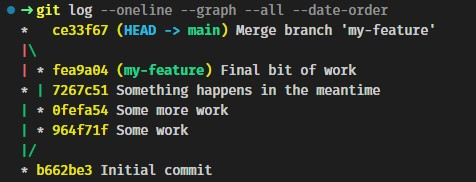

# Git Gud!
## 1: Merge and Rebase

By Sander Beekhuis

---
# Merge

<!-- Waarschijnlijk iedereen wel bekend, voegt twee branches samen in een merge commit -->

- `merge --no-commit`
- `merge --abort`

---

# Rebase

Conceptually: "Moves" a branch to a new location

Actually:
- Does not actually move anything
- Makes new commits based on the old ones
- Asks you to intervene when automatic resolution is not possible

<!-- Some image might be nice -->

---

# Interactive Rebase

`git rebase -i`

Clean up your commit's while rebasing

[image of interactive rebase prompt]

---

# History alteration

[image of stagte after rebase]

Your local changes can not be pushed since they miss remote changes.  Including possibly meaningfull ones.

- `push --force` to the rescue
- `push --force-with-lease`

---

# Merge conflict

Git merge logic:
- Find "merge base" commit
- Create diffs for both branches
- Play both diffs
- Ask user when both diffs edit the same chunk differntly

---

# Time for a lab

