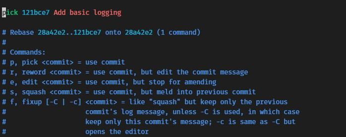

# Git Gud!
## Merge and Rebase

By Sander Beekhuis

---
# Merge

- `merge --no-commit`
- `merge --abort`

---

# Rebase

Conceptually: "Moves" a branch to a new location

Actually:
- Does not actually move anything
- Makes new commits based on the old ones
- Asks you to intervene when automatic resolution is not possible

---

# Interactive Rebase

`git rebase -i` - Clean up your commit's while rebasing.

---

# History alteration

Your local changes can not be pushed in the normal way since they differ from the remote. They can even possibly miss meaningful changes. 

- `push --force` to the rescue
- `push --force-with-lease`

---

# Merge conflict

Git merge logic:
- Find "merge base" commit
- Create diffs for both branches
- Play both diffs
- Ask user when both diffs edit the same chunk differently

---

# Time for a lab
- Will all be CLI git
- Change your git editor if you don't like vim
`git config core.editor notepad`

